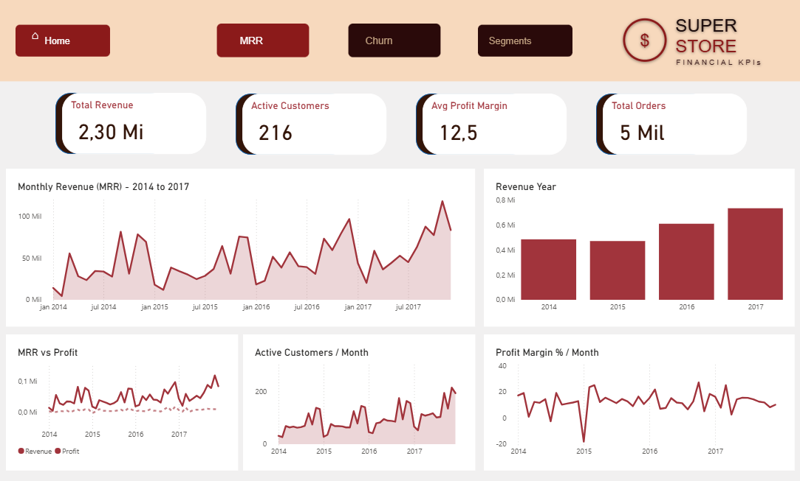
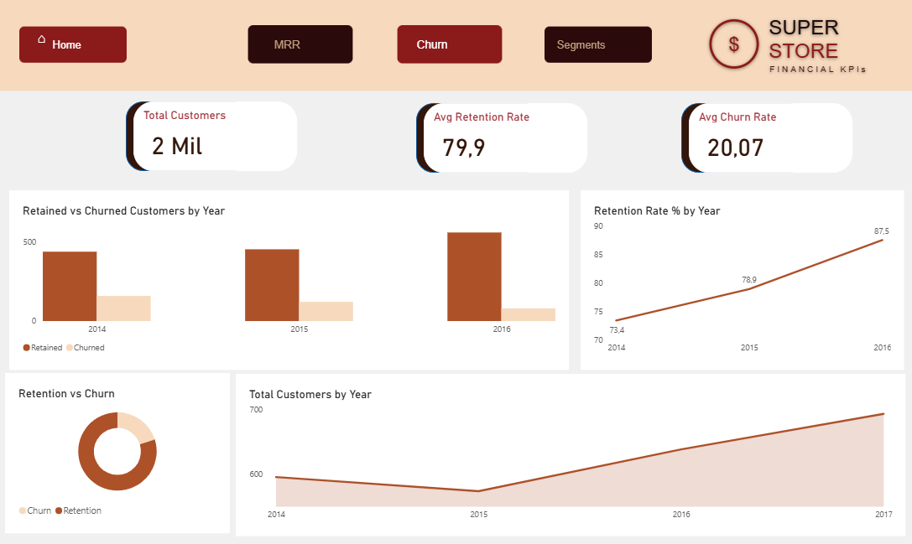
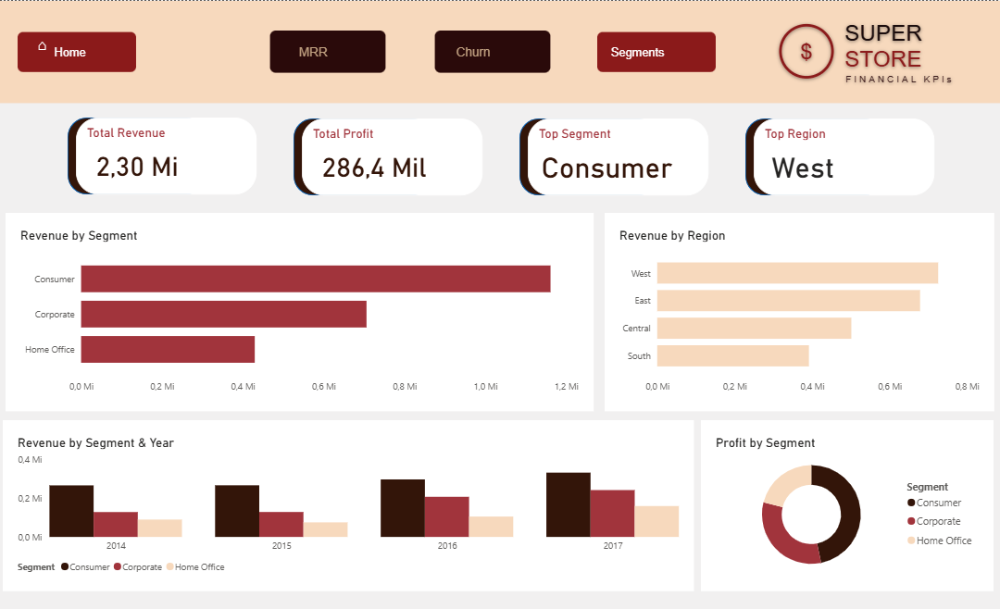

# SaaS Financial KPIs 💰
> Financial analysis of a retail dataset applying SaaS-style metrics — MRR, churn & retention, customer value, discount impact, and segment performance — delivered as a **Power BI dashboard with DAX**, backed by BigQuery SQL. The data ships **inside this repo** (`data/superstore.csv`), so it is reproducible with no external setup.

[](./superstore-financial-kpis.pbix)
[-4285F4?style=flat&logo=google-cloud)](./sql)
[](./data/superstore.csv)
[]()

---

## 📌 Business Context

**Industry:** Retail / SaaS-inspired analytics
**Stakeholders:** Finance, Commercial, and C-level teams
**Business question:** *How does revenue evolve over time, which customers and segments drive the most value, and where is profitability being eroded by discounting?*

This project analyzes **4 years of sales** from the classic Superstore dataset (2015–2018), applying SaaS financial metrics to a retail context. Beyond MRR and churn, it deep-dives into **discount impact on profitability**, customer value tiers, sub-category Pareto, and regional efficiency — insights that support revenue planning, pricing, and retention decisions. The metrics were prototyped in **BigQuery SQL** and delivered as a **Power BI** dashboard with DAX time-intelligence.

---

## 🎯 Objectives

- [x] Analyze MRR trends with MoM growth, 3-month rolling average, and YTD cumulative revenue
- [x] Calculate customer churn and retention rates with boundary-year handling
- [x] Identify the discount threshold above which orders become loss-making
- [x] Rank customers by revenue and profitability using NTILE and PERCENTILE_CONT
- [x] Perform Pareto analysis on sub-categories with cumulative revenue share
- [x] Analyze regional performance with profit efficiency (profit per order)
- [x] Deliver a multi-page Power BI dashboard with DAX time-intelligence measures

---

## 🗂 Dataset

| Field | Details |
|---|---|
| **Source** | Classic **Sample Superstore** — included in this repo at [`data/superstore.csv`](./data/superstore.csv) |
| **Size** | 9,994 order lines · 5,009 orders · 793 customers |
| **Period** | January 2015 – December 2018 |
| **Totals** | US$2.30M sales · US$286K profit (12.5% margin) |

**Key fields:** `Order Date`, `Sales`, `Profit`, `Discount`, `Customer ID`, `Segment` (Consumer / Corporate / Home Office), `Region` (West / East / Central / South), `Sub-Category`.

> **Why the data lives in the repo:** keeping `superstore.csv` in version control makes the whole project self-contained and permanently reproducible — no external download, no cloud account, no data that expires.

---

## 🔧 Technical Approach

### Architecture

```
data/superstore.csv   (versioned in this repo — single source of truth)
        │
        ├────────────► Power BI Desktop  (Get Data ▸ Text/CSV)
        │                 Power Query (M) cleanup → data model → DAX measures
        │                 4 pages: Home · MRR · Churn · Segments
        │
        └────────────► BigQuery table `superstore.orders`  (optional, for the SQL)
                          8 analytical queries prototyping the metrics
```

The **Power BI dashboard** is the primary deliverable; the **SQL** folder documents the same metric logic in BigQuery Standard SQL (window functions, cohort self-joins, Pareto), which prototyped the numbers before they became DAX measures.

### SQL Queries (all validated against the dataset)

| Query | Description |
|---|---|
| [`01_mrr.sql`](./sql/01_mrr.sql) | Monthly MRR, active customers and profit margin |
| [`02_churn.sql`](./sql/02_churn.sql) | Yearly churn and retention — cohort self-join |
| [`03_nrr_segments.sql`](./sql/03_nrr_segments.sql) | Revenue by segment and region with YoY growth |
| [`04_mrr_advanced.sql`](./sql/04_mrr_advanced.sql) | MoM growth (LAG) + 3M rolling avg + YTD cumulative + growth acceleration |
| [`05_subcategory_pareto.sql`](./sql/05_subcategory_pareto.sql) | Sub-category Pareto — cumulative share, profitability flag, YoY |
| [`06_regional_performance.sql`](./sql/06_regional_performance.sql) | Regional deep dive — RANK, profit per order, revenue share, YoY |
| [`07_discount_impact.sql`](./sql/07_discount_impact.sql) | Discount tier analysis — loss rate per tier, margin erosion |
| [`08_customer_value.sql`](./sql/08_customer_value.sql) | Customer ranking — NTILE deciles, PERCENTILE_CONT tiers |

### Power BI Implementation

| Document | Description |
|---|---|
| [`powerbi/measures.md`](./powerbi/measures.md) | DAX measures: time intelligence, rolling avg, YoY, rankings, churn |
| [`powerbi/data_model.md`](./powerbi/data_model.md) | Model, Power Query transformations, and visuals |

---

## 📈 Key Findings

1. **~51% revenue growth over the period** — monthly revenue grew from ≈US$40K/month (2015) to ≈US$61K/month (2018); the 3-month rolling average confirms steady upward momentum.
2. **Retention improving year over year** — churn fell from **26.6% (2015) to 12.5% (2017)**; 2018 is excluded from churn (it is the last year, with no following year to be retained into).
3. **Discounting is the main profit leak** — orders discounted **>30% have an 83% loss rate** (−US$106K profit); profitability turns negative **above ~20% discount**, the effective break-even.
4. **Consumer drives volume, not margin** — the Consumer segment is **50.6% of revenue (US$1.16M)** but the *lowest* margin (11.5%); Home Office and Corporate are more profitable per dollar (14.0% / 13.0%).
5. **West leads on both revenue and efficiency** — West generates **US$725K** and the highest **profit per order (US$67)**; Central is the least efficient (US$34/order).
6. **Sub-category Pareto with a value destroyer** — the top 6 of 17 sub-categories ≈ **65% of revenue**; **Tables** is the biggest loss-maker (−US$18K profit on US$207K revenue) — high volume, negative margin.

*All figures were validated by running the queries in [`/sql`](./sql) against `data/superstore.csv`.*

---

## 📊 Dashboard

**Tool:** Power BI Desktop · **File:** [`superstore-financial-kpis.pbix`](./superstore-financial-kpis.pbix)

| Page | Description |
|---|---|
| **Home** | Summary navigation with key metrics |
| **MRR** | Monthly revenue + 3M rolling avg · active customers · profit margin evolution |
| **Churn** | Yearly retention vs churn · cohort area chart · retained vs churned breakdown |
| **Segments** | Revenue and profit by segment and region · YoY growth comparison |

**Previews:**

| Home | MRR |
|---|---|
|  |  |

| Churn | Segments |
|---|---|
|  |  |

---

## 🚀 How to Reproduce

**Power BI (dashboard):**
1. Open [`superstore-financial-kpis.pbix`](./superstore-financial-kpis.pbix) in Power BI Desktop.
2. If prompted for the source, point it at [`data/superstore.csv`](./data/superstore.csv) (Get Data ▸ Text/CSV).
3. DAX measures are documented in [`powerbi/measures.md`](./powerbi/measures.md).

**SQL (optional):**
1. Load [`data/superstore.csv`](./data/superstore.csv) into a BigQuery table named `superstore.orders` (autodetect keeps the column names and types).
2. Run the queries in [`/sql`](./sql) in order.

---

## 📁 Repository Structure

```
saas-financial-kpis/
├── data/
│   └── superstore.csv               ← dataset (versioned — the single source of truth)
├── sql/                             ← 8 BigQuery analytical queries (validated)
├── powerbi/
│   ├── measures.md                  ← DAX measures
│   └── data_model.md                ← model, Power Query, visuals
├── assets/                          ← dashboard screenshots
├── superstore-financial-kpis.pbix   ← Power BI file
└── README.md
```

---

## 👩‍💻 About

Built by **Ana Paula Borges** · [LinkedIn](https://linkedin.com/in/ana-paula-d-araújo-borges) · [GitHub](https://github.com/ANAPBORGES)

*Senior Data Analyst & Team Leader with 10+ years in BI, DataViz, and Marketing Analytics.*
